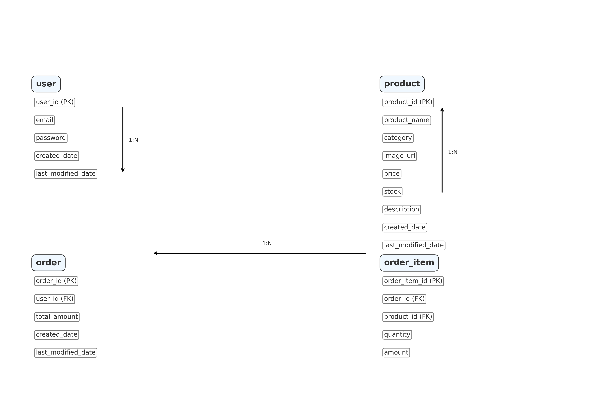

# 🛒 家具商城 Java Web 專案

本專案為使用 Java EE 技術實作的家具商城後台系統，採用經典三層架構設計（MVC + Service + DAO），透過 Servlet、JSP 與 JDBC 完成會員註冊、商品管理、購物車與訂單處理功能。

---

## 🧱 專案目錄結構（部分節錄）

```
- jiaju_mall/
    - jiaju_mall-master/
        - .gitignore
        - src/
            - druid.properties
            - com/
                - hspedu/
                    - furns/
                        - dao/
                            - BasicDAO.java
                            - FurnDAO.java
                            - MemberDAO.java
                            - OrderDAO.java
                            - OrderItemDAO.java
                            - impl/
                                - FurnDAOImpl.java
                                - MemberDAOImpl.java
                                - OrderDAOImpl.java
                                - OrderItemDAOImpl.java
                        - entity/
                            - Cart.java
                            - CartItem.java
                            - Furn.java
                            - Member.java
                            - Order.java
                            - OrderItem.java
                            - P...
```

---

## 🔧 技術棧

- Java 8+
- JSP + Servlet
- JDBC + Druid 資料庫連線池
- MySQL 資料庫
- IntelliJ IDEA 開發工具

---

## 🧠 架構設計：MVC + 三層分離（Controller → Service → DAO）

本專案依循後端開發最佳實踐，採用 MVC 架構與三層分離設計：

### ➤ Controller 層（Servlet）

- 接收 HTTP 請求（如 /login, /register）
- 驗證參數、調用 Service
- 回傳處理結果到 JSP 頁面

### ➤ Service 層

- 處理業務邏輯（如帳號驗證、訂單流程）
- 呼叫 DAO 操作資料庫
- 控制事務與資料轉換

### ➤ DAO 層（資料庫操作）

- 與資料庫互動，執行 CRUD 操作
- 使用 JDBC + Druid 連線池

### ➤ Model（Entity）

- 定義資料結構（如 Member, Furn, Order）
- 對應資料表的 POJO 類別

---

## 🗂️ 主要功能模組

- ✅ 會員註冊與登入驗證
- ✅ 商品查詢與分頁管理
- ✅ 購物車增減、總價計算
- ✅ 訂單建立與查詢
- ✅ 後台管理系統（過濾器實作）

---

## 🛠️ 環境部署

1. 將專案匯入 IntelliJ IDEA
2. 配置資料庫連線（`src/druid.properties`）
3. 導入 SQL 腳本建立資料表
4. 啟動伺服器（Tomcat）
5. 瀏覽器輸入：http://localhost:8080/jiaju_mall

---

## 📘 資料表與 ER 圖

> 資料表包含：`user`, `product`, `order`, `order_item`



---

## 📜 授權 License

本專案使用 MIT License 授權，可自由使用與修改。

---

## 🙋‍♂️ 作者資訊

由 Jensen 開發，學習與練習 Java Web 架構設計之用。
